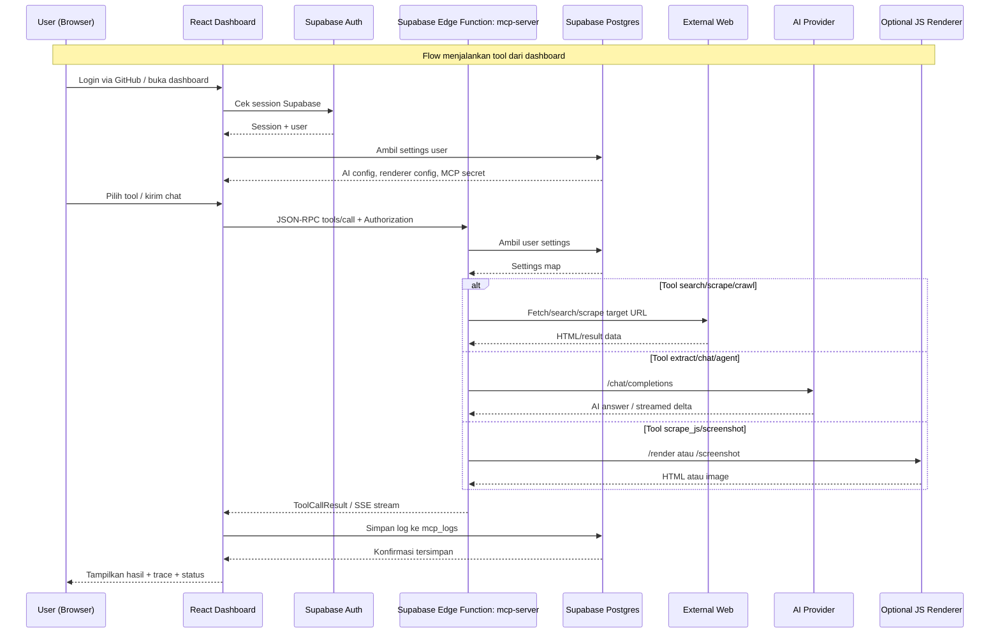
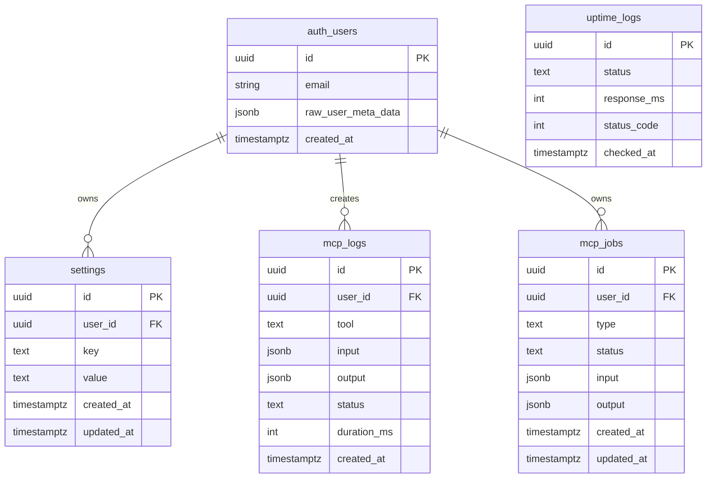

# PRD — Personal Firecrawl MCP

## 1. Overview
Personal Firecrawl MCP adalah aplikasi web berbasis dashboard untuk menjalankan **personal web intelligence server** melalui protokol **Model Context Protocol (MCP)**. Aplikasi ini menyediakan endpoint MCP yang dapat dipakai oleh client eksternal seperti Claude Code CLI, sekaligus menyediakan UI internal untuk menguji tool, memantau request, mengatur provider AI, dan melakukan riset web berbantuan AI.

Masalah utama yang ingin diselesaikan adalah kebutuhan pengguna teknis untuk memiliki server scraping/search/crawl pribadi yang mudah dipakai tanpa harus membuat backend MCP dari nol. Pengguna membutuhkan satu tempat untuk:
- Mengakses endpoint MCP pribadi.
- Menjalankan tool web intelligence seperti search, scrape, crawl, extract, screenshot, dan batch scrape. 
- Menggunakan AI Chat yang otomatis memilih tool sesuai intent.
- Menyimpan konfigurasi provider AI, GitHub token, MCP secret, dan renderer.
- Melihat log request, durasi, status error/success, serta uptime server.

Tujuan utama aplikasi adalah menyediakan dashboard personal yang aman, modern, dan mudah dioperasikan bagi **pengguna tunggal / developer / power user** untuk menjalankan MCP server berbasis Supabase Edge Functions dengan 21 tool MCP. Sebanyak 20 tool operasional tampil di Tool Tester, sedangkan `api_key_manage` memakai halaman MCP Secrets khusus.

## 2. Requirements
Berikut persyaratan tingkat tinggi untuk sistem:

- **Aksesibilitas:** Aplikasi harus dapat diakses melalui web browser modern di desktop/laptop. Tampilan tetap responsif untuk mobile, tetapi penggunaan utama adalah dashboard desktop.
- **Autentikasi:** Pengguna harus login menggunakan GitHub OAuth melalui Supabase Auth sebelum dapat mengakses dashboard.
- **Pengguna:** Sistem dirancang sebagai personal dashboard untuk satu akun pengguna per sesi, dengan isolasi data berdasarkan `user_id`.
- **MCP Endpoint:** Sistem harus menyediakan endpoint MCP publik berbasis Supabase Edge Function yang mendukung `initialize`, `tools/list`, dan `tools/call`.
- **Tool Web Intelligence:** Sistem harus menyediakan tool untuk pencarian web, scraping, crawling, mapping URL, ekstraksi AI, screenshot, batch job, status job, HTML-to-Markdown, dan chat.
- **AI Provider Fleksibel:** Pengguna harus dapat memilih dan mengatur provider AI OpenAI-compatible, termasuk OpenAI, Anthropic-compatible endpoint, MiniMax, Gemini OpenAI-compatible, DeepSeek, Grok/xAI, Groq, Perplexity, Mistral, Cohere, HuggingFace, Together AI, OpenRouter, Ollama lokal, GitHub Copilot, Z.ai, Alibaba DashScope, OpenAdapter, dan provider lain yang mendukung `/chat/completions`.
- **Konfigurasi Aman:** Pengguna dapat menyimpan setting seperti `ai_api_key`, `ai_base_url`, `ai_model`, `renderer_url`, `renderer_secret`, `mcp_secret`, dan GitHub token di Supabase `settings` berdasarkan akun pengguna.
- **Monitoring:** Sistem harus mencatat request MCP ke tabel log dan menampilkan statistik penggunaan harian, status success/error, durasi request, filter tool, ekspor JSON, dan clear logs.
- **Uptime:** Sistem harus menyimpan hasil health check MCP server ke tabel uptime dan menampilkan status operational/degraded, uptime 24h/7d/30d, response time chart, dan riwayat insiden.
- **Async Jobs:** Operasi berat seperti crawl, batch scrape, dan agent research harus berjalan sebagai job asynchronous dengan `jobId` yang dapat dipolling.
- **Renderer Opsional:** Tool `scrape_js` dan `screenshot` hanya aktif jika pengguna mengaktifkan JS Renderer dan mengisi renderer URL.
- **Streaming:** Chat AI harus mendukung response streaming via `text/event-stream` agar pengalaman pengguna cepat dan interaktif.
- **Security:** Endpoint MCP dapat dilindungi dengan `X-MCP-Secret`; data user harus dibatasi oleh Row Level Security (RLS) Supabase.

## 3. Core Features
Fitur-fitur utama yang harus ada pada versi MVP dan pengembangan lanjutan:

1. **GitHub Authentication**
   - Login menggunakan GitHub OAuth melalui Supabase Edge Function `github-auth`.
   - Ambil profil GitHub pengguna seperti username, avatar, nama, dan email.
   - Simpan GitHub access token ke tabel `settings` untuk kebutuhan integrasi Copilot/API GitHub.
   - Buat Supabase magic link session agar user dapat langsung masuk ke dashboard.
   - Tampilkan status GitHub connected dan token availability di halaman Settings.

2. **Dashboard Overview**
   - Menampilkan judul produk `PERSONAL FIRECRAWL MCP`.
   - Menampilkan status server MCP secara real-time melalui GET ke endpoint MCP.
   - Menampilkan endpoint MCP yang dapat dicopy.
   - Menampilkan konfigurasi Claude Code CLI dalam format JSON.
   - Menampilkan ringkasan statistik request hari ini: total request, success request, dan jumlah tool.
   - Menampilkan grid 20 tool operasional yang tersedia, lengkap dengan kategori dan usage count.

3. **MCP Server Endpoint**
   - Mendukung method JSON-RPC:
     - `initialize`
     - `tools/list`
     - `tools/call`
   - Mendukung CORS untuk browser dashboard dan external client.
   - Mendukung `Authorization: Bearer <supabase_access_token>` untuk membaca user settings.
   - Mendukung `X-MCP-Secret` sebagai proteksi tambahan jika secret server diaktifkan.
   - Mengembalikan daftar tool berdasarkan konfigurasi user, misalnya status renderer dan AI provider.

4. **Tool Tester**
   - Pengguna dapat memilih salah satu dari 20 tool operasional.
   - Form input tool dibuat berdasarkan definisi input setiap tool.
   - Menampilkan response tool dalam panel result viewer.
   - Menampilkan activity step seperti preparing request, executing, dan saving log.
   - Mendukung cancel request saat tool sedang berjalan.
   - Tool yang membutuhkan renderer harus disabled jika renderer belum aktif.
   - Untuk `agent_status`, UI menampilkan monitor khusus job agent.

5. **AI Chat Tools-First Assistant**
   - Chat assistant otomatis mengklasifikasikan intent user.
   - Pertanyaan faktual/current/ranking diarahkan ke search terlebih dahulu lalu disintesis.
   - URL tunggal diarahkan ke scrape; URL + pertanyaan diarahkan ke scrape lalu synthesis.
   - Banyak URL diarahkan ke batch scrape.
   - Permintaan crawl/map/screenshot/extract diarahkan ke tool yang sesuai.
   - Permintaan deep research diarahkan ke agent async.
   - Chat casual diarahkan langsung ke provider AI.
   - Mendukung slash commands seperti `/search`, `/scrape`, `/scrape_js`, `/crawl`, `/map`, `/extract`, `/screenshot`, `/search_and_scrape`, `/batch`, `/html`, `/status`, `/agent`, dan `/chat`.
   - Mendukung image upload untuk model vision, termasuk guard untuk provider/model yang tidak diketahui dukungan vision-nya.
   - Mendukung streaming content dan thinking panel.
   - Menampilkan tool trace agar pengguna tahu tool apa saja yang digunakan.

6. **15 MCP Tools**
   - `search`: mencari web via DuckDuckGo dan mengembalikan title, URL, snippet.
   - `scrape`: mengambil URL dan mengubah HTML menjadi Markdown bersih.
   - `scrape_js`: scraping halaman JavaScript-rendered via renderer eksternal.
   - `crawl`: BFS crawl website secara asynchronous dan mengembalikan `jobId`.
   - `map`: crawl ringan untuk memetakan daftar URL/link pada domain.
   - `extract`: scrape URL lalu gunakan AI untuk ekstraksi data terstruktur.
   - `screenshot`: mengambil screenshot halaman via renderer eksternal.
   - `search_and_scrape`: search web lalu scrape top results untuk evidence yang lebih dalam.
   - `html_to_markdown`: konversi raw HTML string menjadi Markdown.
   - `batch_scrape`: scrape banyak URL secara asynchronous dan mengembalikan `jobId`.
   - `check_crawl_status`: cek status dan hasil job crawl.
   - `check_batch_status`: cek status dan hasil job batch scrape.
   - `agent`: autonomous AI research agent untuk search, scrape, dan synthesis.
   - `agent_status`: cek status dan hasil agent job.
   - `chat`: conversational AI assistant dengan orchestration dan streaming.

7. **Request Monitor**
   - Menampilkan tabel request logs dari tabel `mcp_logs`.
   - Filter berdasarkan tool dan status.
   - Auto-refresh setiap 3 detik.
   - Export logs menjadi file JSON.
   - Clear semua logs milik user.
   - Menampilkan status `success` atau `error`, input, output, durasi, dan timestamp.

8. **Uptime Monitor**
   - Menampilkan status server saat ini: `OPERATIONAL`, `DEGRADED`, atau `UNKNOWN`.
   - Menampilkan uptime 24 jam, 7 hari, dan 30 hari.
   - Menampilkan average response time 24 jam.
   - Menampilkan chart response time 24 jam.
   - Menampilkan blok uptime history 90 hari.
   - Menampilkan daftar incident/downtime terbaru.
   - Mendukung tombol `Check Now` untuk memicu Edge Function `uptime-checker`.

9. **Settings**
   - Menampilkan status GitHub authentication dan token Copilot.
   - Re-authenticate GitHub untuk refresh token dan scope.
   - Mengatur MCP Server Secret.
   - Mengatur AI provider, base URL, API key, dan model.
   - Test koneksi AI provider ke endpoint `/chat/completions`.
   - Mengatur JS Renderer URL dan secret.
   - Test koneksi renderer ke `/health`.
   - Danger Zone untuk clear semua request logs.

10. **Async Job Management**
    - Tabel `mcp_jobs` menyimpan job crawl, batch scrape, dan agent.
    - Job memiliki status `pending`, `running`, `completed`, atau `error`.
    - Response awal tool async mengembalikan `jobId`.
    - User dapat polling hasil melalui status tool atau `/status <jobId>`.
    - Job registry lokal di browser menyimpan mapping `jobId` ke tipe job untuk routing status yang lebih akurat.

## 4. User Flow
Alur kerja utama pengguna saat memakai aplikasi:

1. **Login**
   - Pengguna membuka aplikasi web.
   - Jika belum login, pengguna melihat halaman login `FIRECRAWL MCP`.
   - Pengguna klik `Login with GitHub`.
   - Sistem redirect ke GitHub OAuth.
   - Setelah authorization berhasil, Edge Function `github-auth` membuat/menemukan user Supabase, menyimpan GitHub token, lalu redirect balik ke frontend dengan magic link token.
   - Frontend memverifikasi token dan membuat session aktif.

2. **Setup Awal**
   - Pengguna masuk ke Dashboard Overview.
   - Pengguna membuka Settings.
   - Pengguna mengatur AI Provider: provider, base URL, API key, dan model.
   - Pengguna klik `Save & Test` untuk memastikan koneksi AI valid.
   - Jika ingin memakai `scrape_js` dan `screenshot`, pengguna mengaktifkan JS Renderer dan mengisi renderer URL.
   - Jika ingin proteksi tambahan, pengguna mengisi MCP Secret.

3. **Menghubungkan MCP ke Client Eksternal**
   - Pengguna membuka Overview.
   - Pengguna copy endpoint MCP.
   - Pengguna copy konfigurasi Claude Code CLI.
   - Jika MCP secret aktif, konfigurasi menyertakan header `X-MCP-Secret`.
   - Client eksternal memanggil endpoint MCP untuk `initialize`, `tools/list`, dan `tools/call`.

4. **Menjalankan Tool Manual**
   - Pengguna membuka Tool Tester.
   - Pengguna memilih tool, misalnya `search` atau `scrape`.
   - Pengguna mengisi input tool.
   - Sistem mengirim JSON-RPC request ke endpoint MCP.
   - MCP server menjalankan tool dan mengembalikan hasil.
   - UI menampilkan response dan menyimpan request log.

5. **Menggunakan AI Chat**
   - Pengguna membuka AI Chat.
   - Pengguna mengetik pertanyaan natural language atau slash command.
   - Sistem mengklasifikasikan intent.
   - Sistem menjalankan tool yang relevan.
   - Jika perlu synthesis, hasil tool digabung sebagai evidence dan dikirim ke AI provider.
   - UI menampilkan streaming answer dan tool trace.

6. **Monitoring dan Audit**
   - Pengguna membuka Request Monitor untuk melihat request yang terjadi.
   - Pengguna memfilter logs berdasarkan tool/status.
   - Pengguna mengekspor logs jika diperlukan.
   - Pengguna membuka tab Uptime Monitor untuk melihat kesehatan MCP server.

## 5. Architecture
Berikut gambaran arsitektur sistem dan aliran data utama:



### Komponen Utama

| Komponen | Tanggung Jawab |
|----------|----------------|
| **React Frontend** | Dashboard, routing, auth gate, tool tester, AI chat, monitor, settings |
| **Zustand Auth Store** | Menyimpan user, GitHub token, status auth, loading state |
| **TanStack Query** | Data fetching/cache untuk settings, logs, stats, uptime |
| **Supabase Auth** | Session user, magic link verification, GitHub OAuth result |
| **Supabase Postgres** | Penyimpanan settings, request logs, uptime logs, async jobs |
| **Supabase Edge Functions** | Backend MCP server, GitHub OAuth callback, uptime checker, logs/jobs API |
| **MCP Server** | Implementasi JSON-RPC MCP, daftar tool, eksekusi tool, orchestration |
| **AI Provider** | Chat completion, extraction, synthesis, agent reasoning |
| **JS Renderer** | Rendering browser/headless untuk SPA, screenshot, dynamic pages |

### Route Frontend

| Route | Halaman | Fungsi |
|-------|---------|--------|
| `/` | Overview | Status server, endpoint, CLI config, statistik, tool grid |
| `/tester` | Tool Tester | Eksekusi manual tool MCP |
| `/monitor` | Request Monitor | Logs, filters, export, uptime monitor |
| `/settings` | Settings | GitHub, MCP secret, AI provider, renderer, danger zone |
| `/chat` | AI Chat | Chat assistant tools-first dengan streaming dan slash command |
| `*` | Not Found | Fallback route |

### Edge Functions

| Function | Fungsi |
|----------|--------|
| `github-auth` | GitHub OAuth redirect/callback, token exchange, user creation, magic link |
| `mcp-server` | Endpoint MCP utama, JSON-RPC, tool execution, streaming |
| `mcp-logs` | API alternatif untuk create/read/delete request logs |
| `mcp-jobs` | API alternatif untuk create/read async jobs |
| `uptime-checker` | Health check endpoint MCP dan insert ke `uptime_logs` |

## 6. Database Schema
Berikut ERD utama sistem:



| Tabel | Deskripsi |
|-------|-----------|
| **auth.users** | Tabel internal Supabase Auth untuk identitas user GitHub |
| **settings** | Key-value settings per user, termasuk AI config, renderer config, GitHub token, MCP secret |
| **mcp_logs** | Log request tool MCP, input/output JSON, status, durasi, timestamp |
| **uptime_logs** | Hasil health check MCP server, status up/down, response time, status code |
| **mcp_jobs** | Data async job untuk crawl, batch scrape, dan agent research |

### Detail Kolom Penting

#### `settings`
| Kolom | Tipe | Keterangan |
|-------|------|------------|
| `id` | UUID | Primary key |
| `user_id` | UUID | Relasi ke Supabase user |
| `key` | TEXT | Nama setting |
| `value` | TEXT | Nilai setting |
| `created_at` | TIMESTAMPTZ | Waktu dibuat |
| `updated_at` | TIMESTAMPTZ | Waktu update otomatis |

Contoh `key` yang digunakan:
- `github_token`
- `github_pat`
- `mcp_secret`
- `ai_provider`
- `ai_base_url`
- `ai_api_key`
- `ai_model`
- `renderer_enabled`
- `renderer_url`
- `renderer_secret`

#### `mcp_logs`
| Kolom | Tipe | Keterangan |
|-------|------|------------|
| `id` | UUID | Primary key |
| `user_id` | UUID | Pemilik log |
| `tool` | TEXT | Nama tool MCP |
| `input` | JSONB | Argumen request tool |
| `output` | JSONB | Hasil response tool |
| `status` | TEXT | `success` atau `error` |
| `duration_ms` | INTEGER | Durasi eksekusi request |
| `created_at` | TIMESTAMPTZ | Waktu request dibuat |

#### `uptime_logs`
| Kolom | Tipe | Keterangan |
|-------|------|------------|
| `id` | UUID | Primary key |
| `status` | TEXT | `up` atau `down` |
| `response_ms` | INTEGER | Lama response health check |
| `status_code` | INTEGER | HTTP status code dari MCP server |
| `checked_at` | TIMESTAMPTZ | Waktu pengecekan |

#### `mcp_jobs`
| Kolom | Tipe | Keterangan |
|-------|------|------------|
| `id` | UUID | Primary key / `jobId` |
| `user_id` | UUID | Pemilik job |
| `type` | TEXT | `crawl`, `batch_scrape`, atau `agent` |
| `status` | TEXT | Status job |
| `input` | JSONB | Input job |
| `output` | JSONB | Hasil job atau error |
| `created_at` | TIMESTAMPTZ | Waktu job dibuat |
| `updated_at` | TIMESTAMPTZ | Waktu update otomatis |

### RLS Policies

| Tabel | Kebijakan |
|-------|-----------|
| `settings` | User hanya dapat select/insert/update/delete settings miliknya sendiri |
| `mcp_logs` | User hanya dapat select/insert/delete logs miliknya sendiri |
| `mcp_jobs` | User hanya dapat select/insert/update jobs miliknya sendiri |
| `uptime_logs` | Authenticated user dapat membaca uptime logs; Edge Function `uptime-checker` menulis hasil check menggunakan server-side Supabase client |

## 7. Design & Technical Constraints
Bagian ini mengatur batasan teknis dan panduan desain yang harus dipatuhi.

1. **High-Level Technology**
   - Frontend menggunakan React 18 + TypeScript + Vite.
   - Routing menggunakan React Router.
   - Data fetching menggunakan TanStack Query.
   - State auth menggunakan Zustand.
   - UI menggunakan Tailwind CSS, Radix UI/shadcn-style components, dan Lucide icons.
   - Backend menggunakan Supabase Edge Functions berbasis Deno.
   - Database menggunakan Supabase Postgres dengan RLS.
   - External AI provider harus kompatibel dengan OpenAI `/chat/completions` API.

2. **Typography Rules**
   - **Sans:** `Inter, sans-serif`
   - **Display:** `Orbitron, sans-serif`
   - **Mono:** `JetBrains Mono, monospace`
   - Heading utama menggunakan display font untuk nuansa cyber/technical dashboard.
   - Log, endpoint, JSON config, dan output tool menggunakan monospace.

3. **Color & Visual Style**
   - Tema default adalah dark cyber dashboard.
   - Background menggunakan warna gelap `hsl(222 71% 7%)`.
   - Primary color menggunakan cyber cyan `hsl(187 100% 50%)`.
   - Accent menggunakan cyber violet `hsl(258 84% 58%)`.
   - Status success menggunakan cyber green.
   - Status warning menggunakan cyber amber.
   - Status error menggunakan destructive red.
   - Komponen utama menggunakan glass card, border tipis, backdrop blur, dan dot grid background.

4. **Security Constraints**
   - API key AI tidak boleh di-hardcode di frontend source code.
   - GitHub client secret dan service role key hanya boleh berada di environment Edge Function.
   - Data user harus dipisahkan menggunakan `user_id` dan RLS.
   - MCP server dapat dilindungi menggunakan server-level `MCP_SECRET` dan header `X-MCP-Secret`.
   - Catatan implementasi saat ini: UI menyimpan `mcp_secret` per user dan otomatis mengirimnya sebagai `X-MCP-Secret`, sementara enforcement backend membaca environment variable `MCP_SECRET`. Deployment harus menyamakan nilai tersebut atau backend perlu diubah agar validasi secret benar-benar per user.
   - GitHub OAuth redirect origin harus divalidasi terhadap allowlist.
   - Request log tidak boleh memblokir eksekusi tool jika proses logging gagal.

5. **Performance Constraints**
   - Dashboard status server dipolling setiap 30 detik.
   - Request logs auto-refresh setiap 3 detik.
   - Log query dibatasi maksimal 200 data terbaru.
   - Uptime query dibatasi maksimal 1000 data.
   - Tool berat harus asynchronous agar tidak membuat request frontend timeout.
   - Chat request frontend memiliki timeout 60 detik.
   - Tool tester memiliki timeout 30 detik.
   - Evidence synthesis harus membatasi konten yang dikirim ke AI agar tidak terlalu besar.

6. **Reliability Constraints**
   - MCP server GET harus selalu dapat mengembalikan health response `{ status: "ok", server, version, tools }`.
   - Jika AI provider belum dikonfigurasi, tool AI harus mengembalikan error yang jelas.
   - Jika renderer belum aktif, tool renderer harus disabled di UI dan mengembalikan error yang jelas di backend.
   - Async job harus menyimpan status dan output agar dapat dipolling ulang.
   - Uptime checker harus tetap mencatat `down` jika endpoint MCP gagal di-fetch.

7. **Compatibility Constraints**
   - MCP protocol version yang dikembalikan adalah `2024-11-05`.
   - External MCP client harus dapat memanggil endpoint melalui HTTP JSON-RPC.
   - Response streaming menggunakan `text/event-stream`.
   - Tool result mengikuti bentuk MCP content array dengan `type: text` atau `type: image`.

## 8. Functional Requirements Detail

### FR-001 — Login GitHub
- **Deskripsi:** Pengguna dapat login dengan GitHub.
- **Input:** Klik tombol login.
- **Output:** Session Supabase aktif.
- **Acceptance Criteria:**
  - Jika login berhasil, user masuk ke dashboard.
  - Jika OAuth gagal, URL callback membawa `auth_error`.
  - Avatar dan username GitHub muncul di layout/settings.

### FR-002 — Copy MCP Config
- **Deskripsi:** Pengguna dapat menyalin konfigurasi Claude Code CLI.
- **Input:** Klik tombol copy pada config block.
- **Output:** JSON config masuk clipboard.
- **Acceptance Criteria:**
  - Config memuat endpoint `mcp-server`.
  - Jika `mcp_secret` tersedia, config menyertakan header `X-MCP-Secret`.

### FR-003 — Execute Tool Manual
- **Deskripsi:** Pengguna dapat menjalankan tool MCP dari Tool Tester.
- **Input:** Nama tool + argumen tool.
- **Output:** Result panel menampilkan response.
- **Acceptance Criteria:**
  - UI menampilkan loading/activity steps.
  - Error tool tampil jelas.
  - Request tersimpan di `mcp_logs`.

### FR-004 — AI Chat Orchestration
- **Deskripsi:** Chat otomatis memilih tool sesuai request user.
- **Input:** Pesan natural language.
- **Output:** Jawaban assistant + tool trace.
- **Acceptance Criteria:**
  - URL tunggal tanpa konteks menjalankan `scrape`.
  - Pertanyaan factual/current menjalankan `search` lalu synthesis.
  - Deep research menjalankan `agent`.
  - Slash command menjalankan tool eksplisit.
  - Streaming answer terlihat saat response berjalan.

### FR-005 — AI Provider Settings
- **Deskripsi:** Pengguna dapat menyimpan dan mengetes AI provider.
- **Input:** Provider, base URL, API key, model.
- **Output:** Settings tersimpan dan status test tampil.
- **Acceptance Criteria:**
  - Save menyimpan `ai_provider`, `ai_base_url`, `ai_api_key`, `ai_model`.
  - Test mengirim request ke `${baseUrl}/chat/completions`.
  - UI membedakan invalid key, model not found, rate limited, server error, timeout, dan unreachable.

### FR-006 — Renderer Settings
- **Deskripsi:** Pengguna dapat mengaktifkan renderer untuk dynamic page.
- **Input:** Toggle enable, renderer URL, optional secret.
- **Output:** Tool `scrape_js` dan `screenshot` aktif.
- **Acceptance Criteria:**
  - Jika renderer disabled, tool renderer disabled di UI.
  - Test renderer memanggil `${rendererUrl}/health`.
  - Backend memanggil `/render` untuk `scrape_js` dan `/screenshot` untuk `screenshot`.

### FR-007 — Request Monitoring
- **Deskripsi:** Pengguna dapat memonitor request tool.
- **Input:** Filter tool/status, refresh, export, clear.
- **Output:** Tabel logs dan file JSON export.
- **Acceptance Criteria:**
  - Data auto-refresh.
  - Filter tool/status bekerja.
  - Export menghasilkan file `mcp-logs-YYYY-MM-DD.json`.
  - Clear logs hanya menghapus logs user saat ini.

### FR-008 — Uptime Monitoring
- **Deskripsi:** Pengguna dapat melihat kesehatan MCP server.
- **Input:** Check now atau data uptime existing.
- **Output:** Status, uptime %, chart response time, incident list.
- **Acceptance Criteria:**
  - `uptime-checker` insert hasil ke `uptime_logs`.
  - Status `up` ditampilkan sebagai `OPERATIONAL`.
  - Status `down` ditampilkan sebagai `DEGRADED`.

### FR-009 — Async Jobs
- **Deskripsi:** Tool berat berjalan sebagai job asynchronous.
- **Input:** Request `crawl`, `batch_scrape`, atau `agent`.
- **Output:** `jobId` dan status awal `pending`.
- **Acceptance Criteria:**
  - Job tersimpan di `mcp_jobs`.
  - User dapat cek status dengan tool status.
  - Output final tersimpan saat job selesai.

## 9. Non-Functional Requirements

| Kategori | Requirement |
|----------|-------------|
| **Security** | RLS aktif untuk data user; secret tidak di-hardcode; OAuth origin divalidasi |
| **Performance** | Tool ringan selesai dalam beberapa detik; tool berat async; UI tidak freeze saat streaming |
| **Reliability** | Error AI/renderer/search harus ditangani dengan pesan yang dapat dipahami |
| **Maintainability** | Tool definitions frontend dan backend harus tetap sinkron |
| **Observability** | Semua tool call penting tercatat di `mcp_logs` dengan status dan durasi |
| **Usability** | Dashboard harus menyediakan copy endpoint/config, status badge, dan error state jelas |
| **Extensibility** | Tool baru dapat ditambahkan melalui definisi tool, handler backend, dan form UI |

## 10. API Contract

### MCP Health Check
```http
GET /functions/v1/mcp-server
```

Response:
```json
{
  "status": "ok",
  "server": "personal-firecrawl",
  "version": "2.0.0",
  "tools": 15
}
```

### MCP Initialize
```json
{
  "jsonrpc": "2.0",
  "id": 1,
  "method": "initialize"
}
```

### MCP Tools List
```json
{
  "jsonrpc": "2.0",
  "id": 2,
  "method": "tools/list"
}
```

### MCP Tool Call
```json
{
  "jsonrpc": "2.0",
  "id": 3,
  "method": "tools/call",
  "params": {
    "name": "search",
    "arguments": {
      "query": "latest AI agent frameworks",
      "maxResults": 10
    }
  }
}
```

### Standard Tool Result
```json
{
  "jsonrpc": "2.0",
  "id": 3,
  "result": {
    "content": [
      {
        "type": "text",
        "text": "..."
      }
    ]
  }
}
```

### Error Result
```json
{
  "jsonrpc": "2.0",
  "id": 3,
  "error": {
    "code": -32603,
    "message": "Internal server error"
  }
}
```

## 11. Milestones

1. **MVP Dashboard & Auth**
   - GitHub login.
   - Dashboard layout.
   - Overview server status.
   - Settings dasar.

2. **MCP Tool Execution**
   - JSON-RPC endpoint.
   - `tools/list` dan `tools/call`.
   - Tool search, scrape, map, html_to_markdown.
   - Tool Tester UI.

3. **AI & Renderer Integrations**
   - AI provider settings.
   - Chat tool.
   - Extract tool.
   - Renderer settings.
   - `scrape_js` dan `screenshot`.

4. **Async Jobs & Agent**
   - `mcp_jobs` table.
   - Crawl job.
   - Batch scrape job.
   - Agent research job.
   - Status polling.

5. **Monitoring & Observability**
   - Request logs.
   - Request Monitor.
   - Uptime checker.
   - Uptime dashboard.
   - Export dan clear logs.

6. **Polish & Hardening**
   - Error handling detail.
   - Security review.
   - UI responsiveness.
   - Testing dan linting.
   - Documentation setup.

## 12. Risks & Mitigations

| Risiko | Dampak | Mitigasi |
|--------|--------|----------|
| AI provider tidak kompatibel penuh dengan OpenAI API | Chat/extract gagal | Tampilkan error jelas, test provider di Settings, izinkan custom base URL/model |
| Renderer eksternal down | `scrape_js` dan `screenshot` gagal | Tool disabled saat belum configured, test `/health`, status badge |
| Edge Function timeout untuk operasi berat | Crawl/batch/agent gagal | Gunakan async jobs dan polling status |
| Search/scrape target website memblokir request | Result tidak lengkap | Tampilkan failure per source, gunakan user-agent, fallback evidence |
| Secret/API key tersimpan sebagai plain text di settings | Risiko keamanan jika DB bocor | Batasi akses RLS, sarankan project personal, pertimbangkan encryption di iterasi berikutnya |
| Tool definitions frontend/backend tidak sinkron | Form UI tidak cocok dengan backend | Buat single source of truth atau validasi sinkronisasi saat build/test |
| `mcp_secret` tersimpan di UI tetapi backend memvalidasi `MCP_SECRET` env | User mengira endpoint terlindungi, padahal proteksi tidak aktif jika env belum diset; atau request gagal jika nilainya tidak sama | Samakan secret saat deployment, atau refactor validasi backend agar membaca secret per user setelah auth |
| OAuth allowed origins tidak lengkap | Login gagal di domain baru | Update allowlist saat deployment domain berubah |

## 13. Future Enhancements

- Multi-user organization mode dengan role admin/member.
- Encryption at rest untuk API keys dan tokens.
- Scheduler otomatis untuk uptime checker.
- Webhook notification untuk incident/down status.
- Saved prompts dan reusable workflows untuk AI Chat.
- Dashboard analytics per tool per periode.
- Full-text search pada logs dan job outputs.
- Tool marketplace/plugin system.
- Support MCP transport tambahan jika dibutuhkan.
- Rate limiting per user/tool.
- Dedicated renderer deployment template.
- Import/export settings.
- Test suite untuk Edge Function dan tool handlers.

## 14. Current Implementation Snapshot

Snapshot ini ditambahkan setelah PRD dicek ulang terhadap repository saat ini. Bagian ini bukan scope baru, tetapi catatan akurasi agar pengembangan berikutnya tidak perlu mengulang pemetaan awal.

| Area | Status di Repo | Source of Truth |
|------|----------------|-----------------|
| Frontend app | React 18 + TypeScript + Vite, route dashboard aktif di `/`, `/tester`, `/monitor`, `/settings`, `/chat` | `src/App.tsx`, `vite.config.ts`, `package.json` |
| UI system | Tailwind CSS + Radix/shadcn-style components + Lucide icons, tema dark cyber dashboard | `src/index.css`, `tailwind.config.ts`, `src/components/ui/` |
| Auth | GitHub OAuth custom Edge Function, membuat/menemukan Supabase user, menyimpan `github_token`, lalu login via magic link | `supabase/functions/github-auth/index.ts`, `src/App.tsx`, `src/components/AuthGate.tsx` |
| MCP endpoint | HTTP JSON-RPC via Supabase Edge Function, health check GET, `initialize`, `tools/list`, `tools/call` | `supabase/functions/mcp-server/index.ts` |
| Tool registry | Backend mendefinisikan 21 tool MCP; frontend Tool Tester menampilkan 20 tool operasional dan pengelolaan secret berada di halaman khusus | `src/types/tools.ts`, `supabase/functions/mcp-server/tools/definitions.ts`, `supabase/functions/mcp-server/tools/callTool.ts` |
| AI chat | Tools-first routing, slash command, streaming, synthesis berbasis evidence, recency-aware search, image guard | `src/pages/AIChat.tsx`, `src/lib/intentClassifier.ts`, `src/lib/recency.ts`, `src/lib/visionCapability.ts` |
| Async jobs | `crawl`, `batch_scrape`, dan `agent` membuat record job dan diproses via `EdgeRuntime.waitUntil` | `supabase/functions/mcp-server/jobs/`, `supabase/functions/mcp-server/tools/callTool.ts` |
| Monitoring | Request log via Supabase table, filter, export, clear, dan statistik harian | `src/hooks/useRequestLogs.ts`, `src/pages/RequestMonitor.tsx`, `src/components/RequestLogTable.tsx` |
| Uptime | Health check MCP server, chart response time, uptime 24h/7d/30d, 90-day history, incidents | `supabase/functions/uptime-checker/index.ts`, `src/components/UptimeMonitor.tsx`, `src/hooks/useUptimeLogs.ts` |
| Database | `settings`, `mcp_logs`, `uptime_logs`, `mcp_jobs` dengan RLS | `supabase/migrations/`, `src/integrations/supabase/types.ts` |
| Tests | Vitest tersedia untuk recency, MCP helper, URL, markdown, registry, JSON-RPC | `src/test/`, `vitest.config.ts` |

## 15. Development Commands

| Command | Fungsi |
|---------|--------|
| `npm run dev` | Menjalankan Vite dev server di host `::`, port `8080` |
| `npm run build` | Build production Vite |
| `npm run build:dev` | Build mode development |
| `npm run lint` | ESLint untuk repo frontend |
| `npm run test` | Vitest satu kali |
| `npm run test:watch` | Vitest watch mode |
| `npm run preview` | Preview hasil build |

Environment penting:
- `VITE_SUPABASE_URL`
- `VITE_SUPABASE_PUBLISHABLE_KEY`
- `GITHUB_CLIENT_ID`
- `GITHUB_CLIENT_SECRET`
- `SUPABASE_URL`
- `SUPABASE_ANON_KEY`
- `SUPABASE_SERVICE_ROLE_KEY`
- `MCP_SECRET` jika endpoint MCP ingin diproteksi server-side

## 16. Tooling, MCP, and Plugin Audit

Detected stack: React/Vite/TypeScript frontend, Supabase Edge Functions Deno backend, Supabase Postgres/RLS, Tailwind/Radix UI, Vitest, Playwright config, and external MCP/AI/renderer integrations.

Already useful: local shell, repository tests, Playwright dependency/config, project docs under `docs/superpowers/`, and existing Supabase migrations/types.

Recommended always-on: GitHub workflow tooling only when issue/PR work starts; browser testing for UI changes; Supabase/Postgres schema inspection if database migrations or RLS are changed.

Recommended on-demand: official framework/docs lookup for current Supabase, Vite, React, MCP, or AI-provider behavior; Playwright/browser checks for visual UI work; security review workflow before changing auth, token storage, RLS, or MCP secret enforcement.

Not recommended: installing broad global MCP/plugin bundles for this project. Keep tooling project-specific and only enable additional connectors when a concrete task requires them.

Docs to update next: expand `README.md` later with deployment walkthrough, Supabase function deployment steps, OAuth allowed origins, and renderer setup once those workflows are finalized.
