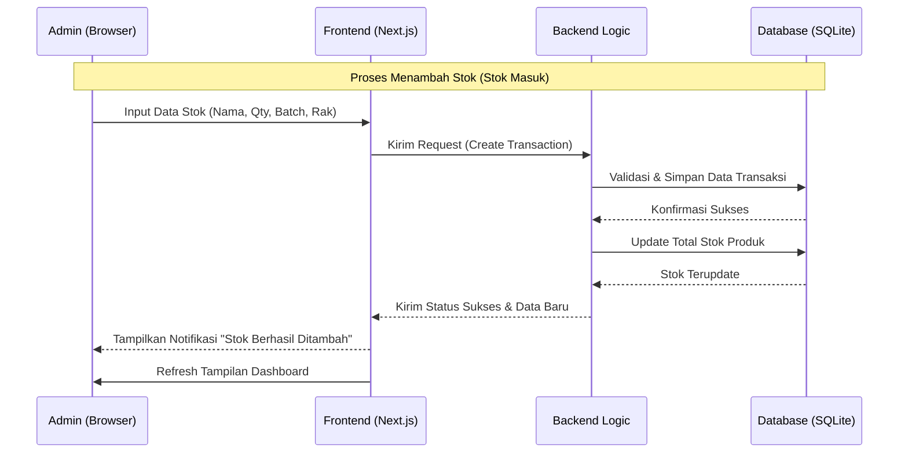
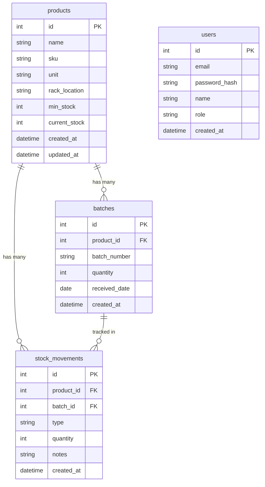

# PRD — Project Requirements Document

## 1. Overview
Aplikasi ini bertujuan untuk mendigitalkan pencatatan stok gudang yang sebelumnya mungkin dilakukan secara manual atau tidak terorganisir. Masalah utama yang ingin diselesaikan adalah kesulitan melacak jumlah stok real-time, lokasi penyimpanan (rak), dan riwayat masuk-keluar barang berdasarkan nomor batch.

Tujuan utama aplikasi adalah menyediakan platform berbasis web yang sederhana bagi **Admin Tunggal** untuk mengelola inventaris, memantau pergerakan stok (masuk/keluar), dan mendapatkan peringatan dini jika stok menipis langsung di dashboard.

## 2. Requirements
Berikut adalah persyaratan tingkat tinggi untuk pengembangan sistem:
- **Aksesibilitas:** Aplikasi harus dapat diakses melalui Web Browser (desktop/laptop diutamakan untuk input data manual).
- **Pengguna:** Sistem dirancang untuk satu pengguna (Admin Tunggal) dengan akses penuh.
- **Data Input:** Input data dilakukan secara manual (diketik), bukan scan barcode.
- **Spesifisitas Data:** Setiap produk harus mencatat informasi mendetail seperti Nomor Batch dan Lokasi Rak.
- **Notifikasi:** Peringatan stok rendah (Low Stock Alert) cukup ditampilkan secara visual di halaman Dashboard.

## 3. Core Features
Fitur-fitur kunci yang harus ada dalam versi pertama (MVP):

1.  **Dashboard Utama**
    - Ringkasan total jumlah produk dan nilai aset (opsional).
    - **Panel Peringatan Stok:** Daftar produk yang jumlahnya di bawah batas minimum.
2.  **Manajemen Produk (Master Data)**
    - Tambah, Edit, dan Hapus Produk.
    - Kolom wajib: Nama Produk, SKU, Satuan, Lokasi Rak, dan Minimum Stok.
3.  **Pencatatan Stok Masuk (Inbound)**
    - Form untuk menambah stok.
    - Input: Pilih Produk, Jumlah, **Nomor Batch**, dan Tanggal Masuk.
4.  **Pencatatan Stok Keluar (Outbound)**
    - Form untuk mengurangi stok.
    - Input: Pilih Produk, Jumlah, Pilih Batch (FIFO/LIFO manual), dan Keterangan.
5.  **Laporan Riwayat (Movement Logs)**
    - Tabel sederhana yang mencatat siapa (Admin), kapan, barang apa, dan berapa jumlah yang masuk/keluar.

## 4. User Flow
Alur kerja sederhana bagi Admin saat menggunakan aplikasi:

1.  **Login:** Admin masuk menggunakan email dan password.
2.  **Monitoring:** Admin melihat Dashboard untuk mengecek apakah ada barang yang perlu dipesan ulang (Low Stock).
3.  **Setup Produk (Awal):** Jika barang baru, Admin membuat data produk baru lengkap dengan lokasi rak.
4.  **Update Stok:**
    - Jika barang datang: Admin membuka menu "Stok Masuk", mengetik jumlah dan nomor batch, lalu simpan.
    - Jika barang keluar: Admin membuka menu "Stok Keluar", memilih produk, mengetik jumlah, lalu simpan.
5.  **Verifikasi:** Sistem otomatis memperbarui sisa stok dan mencatat transaksi di riwayat.

## 5. Architecture
Berikut adalah gambaran arsitektur sistem dan aliran data secara teknis namun sederhana:

## 6. Database Schema

Berikut adalah Entity Relationship Diagram (ERD) yang menggambarkan struktur database utama:

| Tabel | Deskripsi |
|-------|-----------|
| **products** | Master data produk, menyimpan info SKU, satuan, lokasi rak, dan batas stok minimum |
| **batches** | Mencatat setiap batch masuk per produk dengan nomor batch unik |
| **stock_movements** | Log semua transaksi masuk/keluar, terhubung ke produk dan batch |
| **users** | Data admin yang memiliki akses ke sistem |

## 7. Design & Technical Constraints
Bagian ini mengatur batasan teknis dan panduan desain yang harus dipatuhi tanpa mendikte pemilihan library secara spesifik.

1.  **High-Level Technology:**
    Sistem harus dibangun menggunakan teknologi modern yang mendukung pengembangan cepat (rapid development) dan kemudahan pemeliharaan (maintainability). Pengembang dibebaskan memilih tools yang tepat selama tidak terikat pada stack spesifik secara kaku, namun tetap memprioritaskan performa dan skalabilitas untuk penggunaan skala kecil hingga menengah.

2.  **Typography Rules:**
    Sistem antarmuka (UI) wajib menggunakan konfigurasi font variable sebagai berikut untuk menjaga konsistensi visual:
    -   **Sans:** `Geist Mono, ui-monospace, monospace`
    -   **Serif:** `serif`
    -   **Mono:** `JetBrains Mono, monospace`
